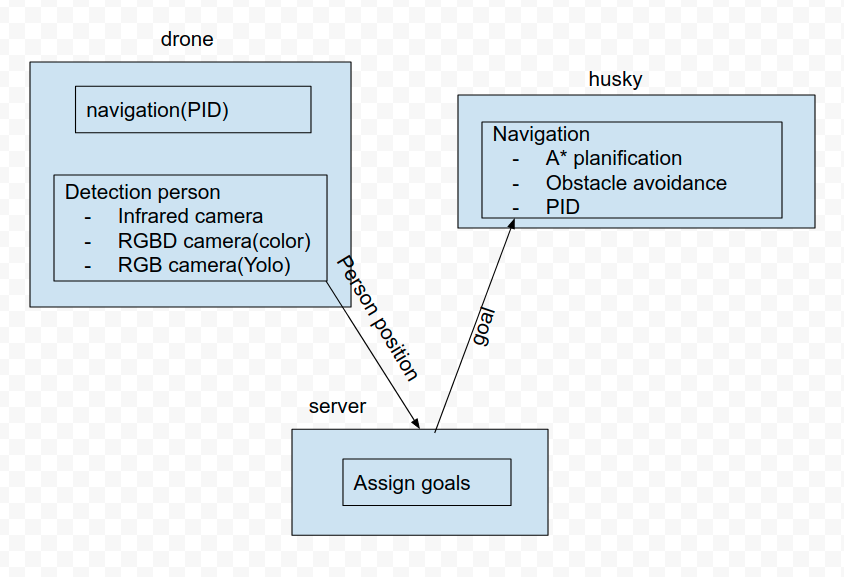
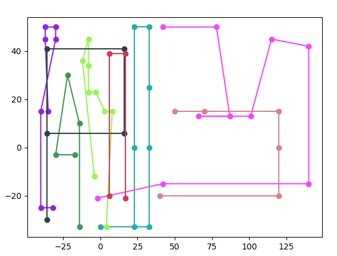
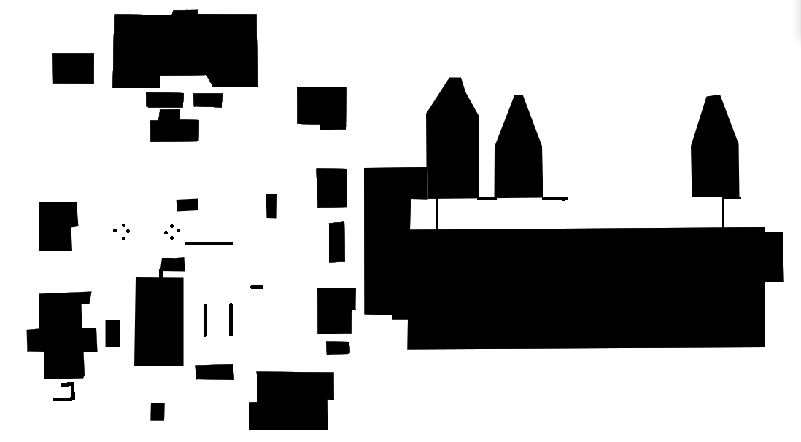

### Simulation in Gazebo

[](https://youtu.be/J6GOlmmIfBc "Simulation in Gazebo")


### Test on Turtlebot2

[](https://youtu.be/wveIgIJ2aT8 "test video on turtlebot2") 


# Introduction

French Directorate General of Armaments (DGA), in collaboration with IP Paris, ISAE-SUPAERO and ENSTA Bretagne, organized this competition with the aim of developing an automated system capable of carrying out rescue missions more quickly.

**Mission :** developed an autonomous system on ROS for UAVs and UGVs to discover and locate the persons on the street, behind walls and under roofs, including the development of **pedestrian detection algorithm**, **robot control algorithm**, **robot path planning algorithm**, **obstacle avoidance algorithm** and **scheduling algorithm** for UAVs and UGVs.

**Honor :** the first place

**Author :** Kai ZHANG, Yan Chen, Mengyu PAN, Yukun LIU


# Method

## Structure



### Drone navigation map



### Husky robot predefined map



### **Control of husky**


When the drones detect the persons, they will send the person’s position to the nearest husky robot. The robots plan a general path to goal with A* algorithm. As the robots travel along the path, there will inevitably be some obstacles. With an obstacle avoidance algorithm, the robot will avoid the obstacles. 

### **Avoidance of obstacle:**


With the Kinect (RGB-D camera), we can have the depth image. In this image, there are two parts: the white one is the ground and the black one is its perspective if there is no obstacle. We focus on the junction of these two parts. When the middle area of this junction is all black, the robot steps forward, otherwise it turns left or right according to black area in the junction. If the whole depth image is black (too near to obstacle), the robot goes back. This is the local avoidance of obstacles.

## Result

In best performance, the drone can detect **7/8** persons and the husky robot can identify **6/8** persons.

In test session, we achieved **3/8** identification and **7/8** detection.

**Video of simulation in Gazebo**

[](https://youtu.be/J6GOlmmIfBc "Simulation in Gazebo")


# Quick Start

### Environment

- ubuntu 18.04
- ros-melodic
- python 2.7
- pytorch 1.4

## Run the code

1. build the simulated environment
2. copy the folder `multi-robot` to replace the original one
3. launch the environment
4. launch the control algorithms
```bash
roslaunch city_sim_gazebo main.launch
roslaunch multi_robot multi_robot_control.launch
```

## Run for yolo 

Download the weights file and put it under `model` directory.

```bash
wget http://pjreddie.com/media/files/yolov3.weights
rosrun yolo yolo_ros.py
```

## Topics

#### input images

- /husky/front_cam/camera/image (you can modify it in `yolo_ros.py` )

#### output detection results

- /result (you can modify it in `yolo_ros.py`)


# Test on Turtlebot 2

## Mapping

**Tool :** gmapping

**Package :** turtlebot_navigation and turtlebot_rviz_launchers


## Test on turtlebot2

[](https://youtu.be/wveIgIJ2aT8 "test video on turtlebot2")

# Problems

Although we got the first place, the automatic system still needs to be improved.

1. Can we develop an algorithm that can effectively avoid obstacles in a dense environment ？

   

2. Can we reseanably consider the kill zones for drone navigation ?

